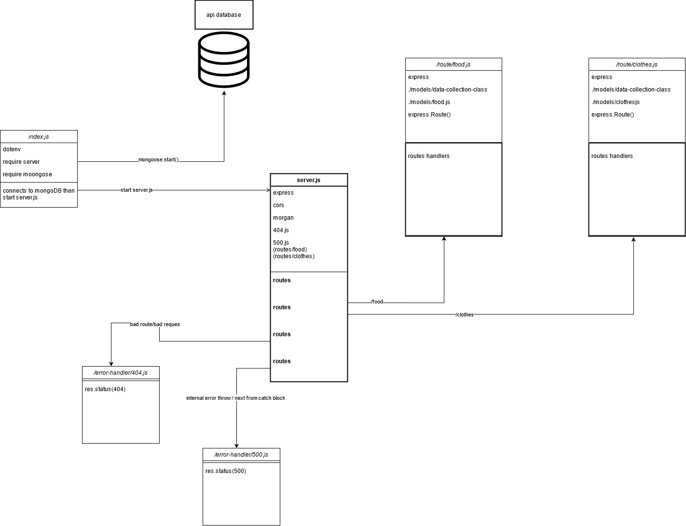

# LAB - 04

## Deployment Test

### Author: Mohammad Quthama

- [submission PR](https://github.com/mohammad-qethama/api-server/pull/1)
- [tests report](https://github.com/mohammad-qethama/api-server/actions)
- [master-deployment](https://api-server-maq.herokuapp.com/)

### Setup

#### `.env` requirements

- `PORT` - 3000
- `MONGOOSE_URI` - `mongodb+srv://<username>:<password>@cluster0.pyufn.mongodb.net/ApiDataBase`

#### Dependencies

- mongoose.
- cors.
- express.
- dotenv
- morgan

#### Devdependencies

- eslint
- jest
- supertest

#### Running the app

- `npm start`

- Endpoint: `/food`
  - Returns status(200)
  - returns json file with the content of the DB table `foods`

```JavaScript

 async function getHandlerList(req,res,next){
     try {
        let resObj = await foodMngr.read();
        res.status(200).json(resObj);
     } catch (error) {
         next(error);         
     }
    

 }

```

- Endpoint: `/clothes`
  - Returns status(200)
  - returns json file with the content of the DB table `clothes`

```JavaScript

  async function getHandlerList(req,res,next){
    try {
        let resObj = await clothesMngr.read();
        res.status(200).json(resObj);
    } catch (error) {
        next(error);
        
    }
}
```

#### Tests

- Unit Tests: `npm run test`
  - test for logger.js
  - test for server.js

#### UML


